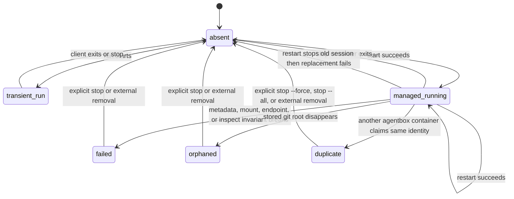

# Agentbox Architecture

This directory defines the normative implementation contract for satisfying the user-visible guarantees in `docs/spec`. The architecture is an end-state design contract: implementation may change internally, but it must preserve these ownership boundaries, invariants, and failure-handling rules.

## Responsibility Boundaries

- The CLI boundary owns argument parsing, prompt rendering, stdout/stderr routing, exit codes, and conversion of domain failures into actionable user errors.
- The completion and packaging boundary owns installed shell completion and manual assets; dynamic completion must reuse live session discovery and command eligibility contracts rather than maintaining an independent session cache.
- The workspace resolver owns directory validation, git-root discovery, canonical path resolution, target-directory containment checks, and construction of the stable workspace identity token.
- The lifecycle coordinator owns command-level orchestration for `run`, `exec`, `start`, `restart`, `connect`, `ps`, `health`, `stop`, `clean`, and `runtime update`; it must not embed Podman JSON parsing, runtime-specific probe logic, or filesystem passthrough details directly.
- The session discovery layer owns live Podman inspection, agentbox ownership classification, managed versus transient classification, status derivation, endpoint recovery, and detection of duplicate, orphaned, failed, and name-conflict states.
- The runtime catalog owns runtime-specific server commands, host-client commands, readiness probes, health probes, endpoint schemes, default image identities, host state passthrough requirements, and Codex attach-token requirements.
- The container execution adapter owns Podman command construction, inspect result normalization, container stop verification, published-port discovery, mount construction, resource-limit application, and mapping of Podman failures into domain errors.
- The image manager owns content-hash-tagged default image references, runtime package version resolution, default image build or reuse decisions, image ownership labels, runtime image metadata, and image update semantics.
- The host integration layer owns host Git identity lookup, Git excludes lookup, SSH signing passthrough, SSH known-host discovery, user config loading, resource-limit default resolution, host-attached Nix validation, runtime host-client lookup, and development-environment wrapper selection.
- The state store owns only durable agentbox state that is not recoverable from live Podman state: runtime image metadata and Codex managed-session attach tokens.
- Presentation code must depend on domain results and errors; domain, discovery, runtime, image, and state layers must not depend on terminal rendering.

## Data Ownership And Sources Of Truth

- Live Podman container state is the source of truth for running managed sessions and transient `run` containers.
- Agentbox must not require a host-side session database to discover, connect to, stop, restart, list, or health-check running sessions.
- Managed-session container labels own recoverable session metadata: managed ownership marker, schema version, canonical git root, stable identity token, runtime, default image reference, launch directory, logical name, attach metadata, stored server arguments, and stored resource limits.
- Transient `run` container labels own only the metadata needed for discovery, `ps`, `stop`, endpoint recovery during the owning process, and collision detection; transient containers must not carry the managed ownership marker.
- Runtime image metadata under agentbox state records image version and build facts, but it must not be required to recognize or stop running sessions.
- Codex managed-session attach tokens are stored in agentbox state and are addressed by the session identity; only token hashes are passed into managed containers.
- User config is a strict input contract. Invalid config is isolated by moving it aside when possible and is ignored for the current invocation.
- Named runtime cache volumes are owned by Podman and keyed by workspace identity. Session lifecycle commands must preserve them unless the explicit cleanup command selects them.

## Identity And Naming

- Workspace identity is derived only from the canonical git root after symlink resolution and target-directory containment validation.
- Runtime, launch directory, requested command path spelling, and ambient Podman state must not alter workspace identity.
- Deterministic managed container names and runtime cache volume names must be derived from the same workspace identity.
- The naming algorithm must be stable for a canonical git root and must fail on name conflicts or identity collisions rather than generating alternate names.
- Discovery scoped to one workspace must use the stable identity token when available and must treat missing tokens conservatively until full inspection proves whether a container matches.
- Stable public ids are domain identifiers derived from the workspace identity label; Podman container ids must not be exposed as session ids.

## Lifecycle Coordination

- Lifecycle mutations for a recoverable canonical git root must be serialized by a per-workspace lock before `run`, `exec`, `start`, `restart`, `stop`, or interrupt cleanup creates, stops, or cleans up containers for that workspace.
- Every mutating lifecycle command must re-discover the relevant live Podman state after acquiring the lock and before mutating anything.
- `run` and `start` must fail before container creation when any managed session or transient `run` container already claims the target workspace.
- `exec` must fail before foreground container creation when a managed session already claims the target workspace.
- `restart` must validate the target, stored runtime, launch directory, server arguments, resource limits, host prerequisites, optional host client, and replacement image before stopping the old container.
- `restart` must verify that the old container is gone before starting a replacement; if stop verification fails, it must not start a replacement.
- `stop` must treat an already-removed matching container as success only after absence is verified.
- Explicit stable-id stops must re-discover exact live matches immediately before stopping and must not broaden selection to name, image, or image-label matches.
- `stop --all` is the only lifecycle operation that may intentionally stop running agentbox-owned containers without a recoverable workspace selector, such as a canonical git root or stable identity.
- Interrupt cleanup for a partially-created `start` must be best-effort, scoped to resources created by that invocation, and must preserve pre-existing images and cache volumes.
- Session lifecycle commands must never infer container ownership from image names, image labels, or container-name patterns alone; container ownership requires an agentbox ownership label.

## State Transitions

- State classification is derived from live discovery at command time.
- `connect`, `restart`, and `health` may operate only on sessions whose discovered state satisfies their command-specific eligibility rules.
- Failed, orphaned, duplicate, stopped, and transient resources must not be silently coerced into valid managed running sessions.
- A replacement failure after `restart` stops the old container is an allowed non-atomic transition and must be reported explicitly.

## Runtime And Filesystem Assembly

- Runtime-specific command construction must flow through the runtime catalog so supported runtimes share lifecycle orchestration while preserving distinct server, client, readiness, health, image, and passthrough contracts.
- Container assembly must bind-mount the canonical git root at the same absolute path and set the runtime process working directory from the launch contract selected by the command.
- The container adapter must mount `/home/user` as the workspace runtime cache named volume and must reject bind mounts or missing mounts where a named volume is required.
- Host state passthroughs for Codex, OpenCode, Git identity, Git excludes, SSH signing, known_hosts, and host-attached Nix must be assembled during launch preparation and passed into container construction as explicit mount and environment contracts.
- Host passthrough lookups must use an explicit launch repository: the resolved canonical git root for new container launches, and the recovered managed-session git root for `restart`.
- Temporary host files used as mount sources must live at least until the corresponding container mount is established and must not become durable agentbox state.
- Agentbox must not repair host permissions, mutate workspace ownership, create runtime host state directories, or synthesize missing host-attached Nix prerequisites.
- Development-environment wrapper selection must be determined from the launch directory before runtime command execution; after a provider is selected, provider startup failure is terminal and must not fall back to a lower-priority provider.

## Endpoint, Token, And Client Handling

- Attach endpoints must be published on loopback by default and discovered from Podman published-port data before reporting readiness or launching a host client.
- Readiness and health checks must use the runtime catalog's official runtime probe, not raw TCP success.
- Managed endpoint metadata in labels and Podman's published-port data must agree before a session is connectable.
- Host client processes must inherit stdio and run from the command-specific working directory defined by the spec.
- Loopback client connections must preserve inherited proxy variables while ensuring loopback hosts are excluded through both `NO_PROXY` and `no_proxy`.
- Codex attach-token generation, hashing, state storage, environment injection, and missing-token errors must be owned by a single token service so server and client sides cannot diverge.
- Capability tokens must not be written to container labels, command-line arguments visible inside the managed container, or user-facing output.

## Runtime Image And Cleanup Architecture

- The image manager must compute the selected runtime's current default image reference from the embedded runtime image inputs and selected runtime package version.
- The image manager must own the stable embedded runtime image input set used for the context hash and must exclude documentation, developer tooling, and image tests from that hash.
- Image build inputs, image labels, runtime package metadata, and runtime image metadata must be consistent enough for `run`, `start`, `restart`, `runtime update`, and `clean` to make the same ownership and reuse decisions.
- Default image creation and `runtime update` may mutate runtime image metadata; session lifecycle commands may read it but must not depend on it to discover live sessions.
- `clean` must discover image cleanup candidates from agentbox image ownership labels and volume cleanup candidates from current workspace cache volume naming rules.
- Cleanup must skip resources used by any Podman container, must continue after per-resource deletion failures, and must never call broad Podman prune operations.
- `stop` and `restart` must never delete default runtime images or named runtime cache volumes.

## Output, Errors, And Observability

- Command implementations must preserve stdout for requested data output and inherited runtime/client stdout only; logs, progress, prompts, diagnostics, and application errors must use stderr.
- Domain errors must carry the command, workspace or resource identity when recoverable, external command context when relevant, and a concise remediation hint when the spec defines one.
- Parse errors remain owned by the CLI parser; application errors must use the shared diagnostic format.
- Verbose diagnostics may reveal external commands and forwarded external command output, but they must not replace machine-readable stdout.
- Readiness and startup failures for managed containers must include bounded container log excerpts when Podman can provide them.
- Discovery must normalize missing or `null` JSON collections to empty collections so unrelated ambient containers cannot cause lifecycle failures.

## Consistency, Idempotency, And Recovery

- All lifecycle operations must be idempotent where the spec defines repeated success, such as stopping an already-removed selected container after absence verification and running cleanup when no candidates exist.
- Best-effort cleanup must report partial failures and must not hide the primary failure that triggered cleanup.
- Commands must fail closed on malformed managed-session metadata that affects identity, runtime selection, endpoint recovery, launch directory, server arguments, resource limits, cache volume mounts, or authorization.
- Duplicate resources must be surfaced as duplicates and never resolved by arbitrary ordering.
- External process failures must be mapped without losing the underlying command name and exit status when available.
- Recovery guidance must prefer explicit user actions: `stop`, `stop --force`, `stop --all`, `start`, `restart`, `runtime update`, `clean`, or direct Podman removal only when a resource cannot be safely matched by agentbox.
