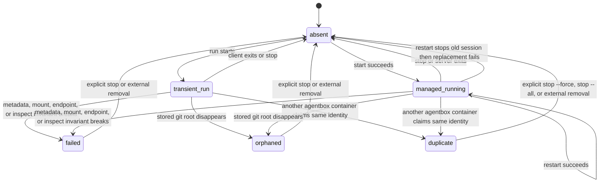

# Lifecycle Coordination Boundary

The lifecycle coordinator owns command-level orchestration for `run`, `exec`, `start`, `restart`, `connect`, `ps`, `health`, `stop`, `clean`, and `runtime update`; it must not embed Podman JSON parsing, runtime-specific probe logic, or filesystem passthrough details directly.

## Contracts

- Lifecycle mutations for a recoverable canonical git root must be serialized by a per-workspace lock before `run`, `exec`, `start`, `restart`, `stop`, or interrupt cleanup creates, stops, or cleans up containers for that workspace.
- Every mutating lifecycle command must re-discover the relevant live Podman state after acquiring the lock and before mutating anything.
- `run` and `start` must fail before container creation when any managed session or transient `run` container already claims the target workspace.
- `exec` must fail before foreground container creation when a managed session already claims the target workspace.
- Command eligibility must be decided from discovered domain state before command-specific action: `connect`, `restart`, and `health` require exactly one eligible managed running session, while duplicate, transient-only, failed, orphaned, stopped, or malformed state follows the command-specific failure path.
- `restart` must validate the target, stored runtime, launch directory, server arguments, resource limits, host prerequisites, optional host client, and replacement image before stopping the old container.
- `restart` must verify that the old container is gone before starting a replacement; if stop verification fails, it must not start a replacement.
- `stop` must treat an already-removed matching container as success only after absence is verified.
- Explicit stable-id stops must re-discover exact live matches immediately before stopping and must not broaden selection to name, image, or image-label matches.
- `stop --all` is the only lifecycle operation that may intentionally stop running agentbox-owned containers without a recoverable workspace selector, such as a canonical git root or stable identity.
- Interrupt cleanup for a partially-created `start` must be best-effort, scoped to resources created by that invocation, and must preserve pre-existing images and cache volumes.
- A replacement failure after `restart` stops the old container is an allowed non-atomic transition and must be reported explicitly.
- Managed Codex `start` and `restart` must coordinate token creation, hashing, state persistence, container launch, readiness, and optional host-client launch so a reported-ready Codex session has matching token state available for later `connect`.
- All lifecycle operations must be idempotent where the spec defines repeated success, such as stopping an already-removed selected container after absence verification and running cleanup when no candidates exist.
- Best-effort cleanup must report partial failures and must not hide the primary failure that triggered cleanup.

## State Transitions

